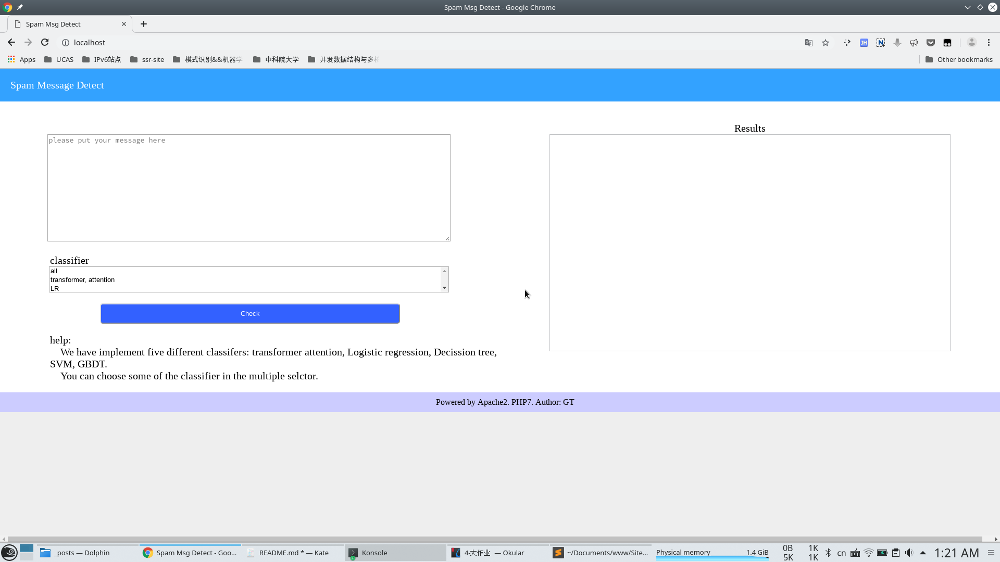
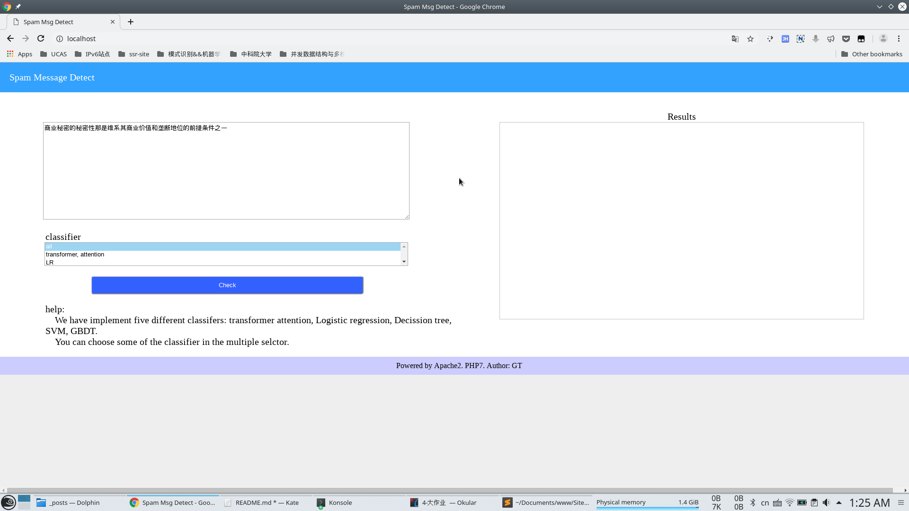
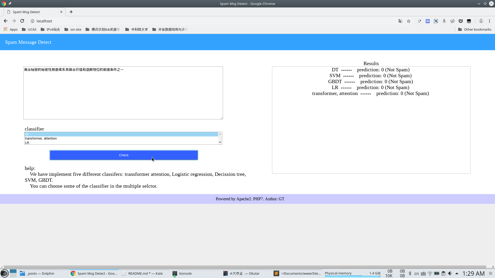
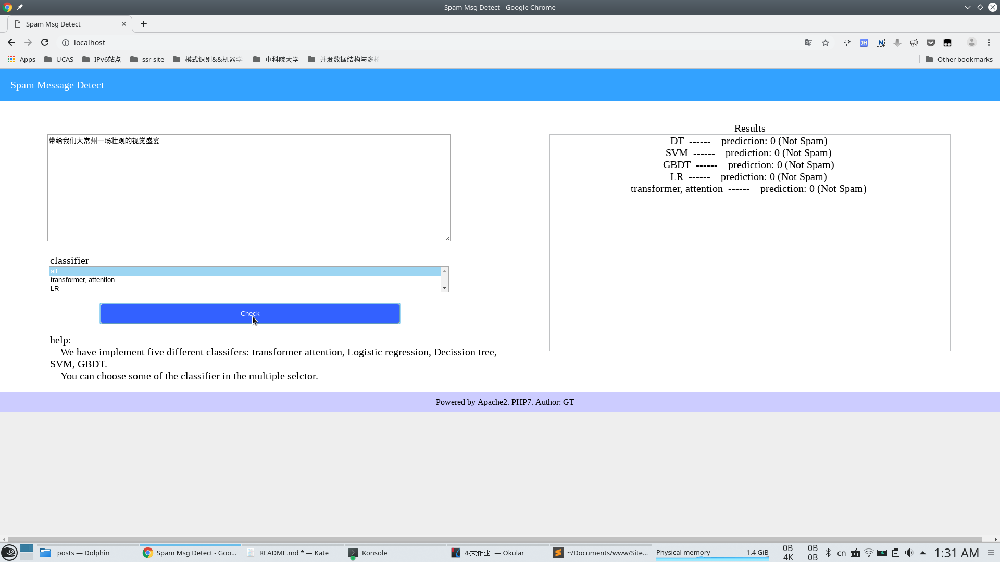

## 网络数据挖掘大作业在线演示系统
本文讲述了本小组网络数据挖掘大作业实现算法的在线演示系统的搭建过程, 使用过程.
| -- | -- |
| 架构 | B/S |
| 软件 | apache2, php7 |
| 系统 | opensuse tumbleweed |
| -- | -- |

### 演示原理
1. 使用`apache2`搭建服务器.
2. 前台利用`form`表单传递需要预测的短信和使用的分类器. 
3. 后台接收到数据后, 利用`php`函数`exec()`执行`shell`命令, 此处的shell命令是`python`命令调用python文件,
4. 得到预测的结果, 返回前台界面显示.

### 环境搭建
讲述搭建`apache2`+`php7`环境的主要过程.

#### 搭建apache2服务器
1. 安装`apache2`
```shell
zypper install apache2
```

2. 配置`apache2`
默认配置文件目录位于`/etc/apache2`. 先添加一个`Virtual Host`, 复制`vhosts.d`下的`vhost.template`文件为`site1.conf`文件,并修改如下:
```shell
<VirtualHost *:80>
    ServerName localhost
    DocumentRoot /home/gt/Documents/www/Site
    CustomLog /var/log/apache2/localhost.site1.com-access_log combined
    ScriptAlias /cgi-bin/ "/home/gt/Documents/www/Site/cgi-bin/"
    
    <Directory "/home/gt/Documents/www/Site/cgi-bin">
        AllowOverride None
        Options +ExecCGI -Includes
        <IfModule !mod_access_compat.c>
            Require all granted
        </IfModule>
        <IfModule mod_access_compat.c>
            Order allow,deny
            Allow from all
        </IfModule>
    </Directory>
    
    <IfModule mod_userdir.c>
        UserDir public_html
        Include /etc/apache2/mod_userdir.conf
    </IfModule>

     <Directory "/home/gt/Documents/www/Site">
        Options Indexes FollowSymLinks
        AllowOverride None
        <IfModule !mod_access_compat.c>
            Require all granted
        </IfModule>
        <IfModule mod_access_compat.c>
            Order allow,deny
            Allow from all
        </IfModule>
    </Directory>
</VirtualHost>
```
可以启动apache2, 默认监听端口为80
```shell
systemctl start apache2
```

#### 搭建`php7`环境
1. 安装`php7`
```shell
zypper install php7
```

2. 配置`apache2`解析`php`文件
安装`apache2-mod_php7`扩展, 添加php7扩展模块到apache2中
```shell
zypper install apache2-mod_php7
a2enmod php7
```
修改apache配置文件`httpd.conf`, 添加:
```shell
<FilesMatch \.php$>
SetHandler application/x-httpd-php
</FilesMatch>

AddType application/x-httpd-php .html .htm .php .phtml
AddType application/x-httpd-php-source .html .htm .phps
```
重启`apache2`, 可以使用`phpinfo()`函数测试环境搭建情况.

#### 站点文件
将演示系统的文件按放在`/home/gt/Documents/www/Site`目录下(指定的DocumentRoot目录下), 并且保证`.php` 文件具有644以上的权限.

### 在线系统演示

#### 基本使用
1. 在浏览器中输入`localhost`, 可以看到主界面


2. 在`textarea`里中输入预测的短信, 在`selector`中选择预测的分类器(可多选)


3. 点击`Check`按钮, 开始预测, 结果将显示在右侧的结果框中


#### 案例测试
1. 正常短信预测


2. 垃圾短信测试


可以看到两次短信预测结果全部分类器均预测正确, 说明选择自训练集中的样本预测误差已经很小.
